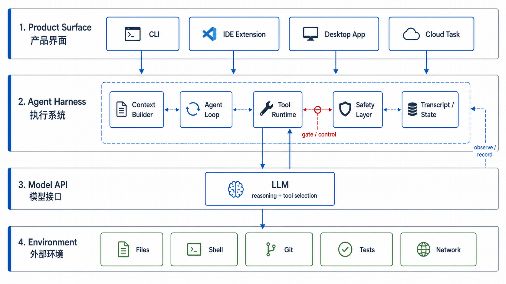

# Day 01 - What is an Agent Harness / 什么是 Agent Harness

## 文章介绍

这是 14 天系列的第一篇。本文不急着写代码，而是先建立一张地图：当我们说 Cursor、Codex、Claude Code 这类 coding agent 产品时，到底是在说模型、agent，还是模型外面的 harness。

读完这一篇，你应该能分清三件事：

- OpenAI、Anthropic 这类模型接口提供了什么。
- Agent loop 在普通 chat 和 tool calling 之上多做了什么。
- 一个 coding agent harness 需要负责哪些工程问题。

后续 13 天会把本文提到的模块逐步落成代码。

## 今天要解决什么

如果你从外面看 Cursor、Codex、Claude Code 这类产品，很容易把它们理解成“一个更会写代码的模型”。但真正决定产品能力的，往往不是模型本身，而是模型外面那套系统。

这套系统就是本文要讨论的 **Agent Harness**。

它负责回答这些问题：

- 用户的一句话任务，应该怎样变成模型可理解的上下文？
- 模型想读文件、搜索代码、运行测试、修改文件时，谁来执行？
- 模型能不能直接删文件、联网、运行 shell？
- 一次多步任务的中间状态怎么保存？
- 当上下文越来越大时，应该保留什么、压缩什么、丢掉什么？
- 出错以后，开发者怎么知道是哪一步出了问题？

这些问题不是靠模型单独解决的，而是由 harness 里的不同模块分别解决：

| 问题 | 负责的模块 | 第一阶段会做到什么 |
| --- | --- | --- |
| 用户任务怎样变成模型上下文？ | Context Builder | 组装 system prompt、用户请求、工具定义、项目规则和相关文件片段 |
| 模型想读文件、搜索代码、运行测试、修改文件时，谁来执行？ | Tool Runtime | 把模型的 tool call 分发到本地函数、shell 或 patch 执行器 |
| 模型能不能直接删文件、联网、运行 shell？ | Safety Layer | 限制 workspace 范围，对写文件和命令执行加 approval |
| 一次多步任务的中间状态怎么保存？ | Agent Loop + Transcript | 保存每一步的模型输出、工具调用、工具结果和最终状态 |
| 上下文越来越大时，保留什么、压缩什么、丢掉什么？ | Context Builder | 先做结构化 context part 和 token 估算，后续再做检索与压缩 |
| 出错以后，开发者怎么知道是哪一步出了问题？ | Transcript | 用 JSONL 记录关键事件，让一次 agent run 可以被检查和复盘 |

所以第一天我们不急着写代码，而是先把边界讲清楚：**模型是什么，agent 是什么，harness 又是什么。** 后面每一天会把上表里的一个模块落成代码。

## 常见接口形态

现在主流 LLM 产品和 agent 产品，通常会暴露几类接口。它们看起来都在“调用模型”，但抽象层级不同。

### 1. Chat Interface

最基础的是聊天接口。调用方传入输入，模型返回一段 assistant 输出。

用 OpenAI Responses API 写，形态大概是这样：

```ts
import OpenAI from "openai";

const client = new OpenAI();

const response = await client.responses.create({
  model: "gpt-5.5",
  instructions: "You are a concise coding assistant.",
  input: "Explain what this repository does.",
});

console.log(response.output_text);
```

这种接口适合问答、解释、总结、生成文本。它的关键特征是：**模型只负责生成下一条回复**。

如果你问：

```text
帮我解释这个函数
```

模型本身并不知道“这个函数”在哪里。除非调用方提前把代码塞进上下文，否则模型没有能力读取你的文件系统。

Anthropic Messages API 也是同一个边界，只是字段形态不同：

```ts
import Anthropic from "@anthropic-ai/sdk";

const client = new Anthropic();

const message = await client.messages.create({
  model: "claude-opus-4-8",
  max_tokens: 1024,
  system: "You are a concise coding assistant.",
  messages: [
    {
      role: "user",
      content: "Explain what this repository does.",
    },
  ],
});

console.log(message.content);
```

不管是 OpenAI 的 `input`，还是 Anthropic 的 `messages`，这里都还只是“文本进、文本出”。没有工具执行，也没有本地代码库访问。

### 2. Tool Calling Interface

下一层是工具调用接口。模型不只返回自然语言，还可以返回一个结构化动作。

OpenAI Responses API 里，工具定义会放在 `tools` 参数里。下面是一个真实形态的 `read_file` 工具定义：

```ts
const response = await client.responses.create({
  model: "gpt-5.5",
  input: "Read README.md and summarize it.",
  tools: [
    {
      type: "function",
      name: "read_file",
      description: "Read a UTF-8 text file from the current workspace.",
      parameters: {
        type: "object",
        properties: {
          path: {
            type: "string",
            description: "Workspace-relative file path, for example README.md",
          },
        },
        required: ["path"],
        additionalProperties: false,
      },
    },
  ],
});
```

如果模型决定使用工具，响应里会出现类似 `function_call` 的输出项。你的程序需要找到这个输出项，读取 `name`、`call_id` 和 `arguments`，然后自己执行对应函数。执行完之后，再把结果作为 `function_call_output` 发回模型：

```ts
const toolResult = await readFileFromWorkspace("README.md");

const finalResponse = await client.responses.create({
  model: "gpt-5.5",
  input: [
    { role: "user", content: "Read README.md and summarize it." },
    ...response.output,
    {
      type: "function_call_output",
      call_id: "call_abc123",
      output: toolResult,
    },
  ],
  tools: [
    {
      type: "function",
      name: "read_file",
      description: "Read a UTF-8 text file from the current workspace.",
      parameters: {
        type: "object",
        properties: {
          path: { type: "string" },
        },
        required: ["path"],
        additionalProperties: false,
      },
    },
  ],
});
```

Anthropic 的工具定义也放在请求顶层的 `tools` 里，但 schema 字段叫 `input_schema`：

```ts
const message = await client.messages.create({
  model: "claude-opus-4-8",
  max_tokens: 1024,
  tools: [
    {
      name: "read_file",
      description: "Read a UTF-8 text file from the current workspace.",
      input_schema: {
        type: "object",
        properties: {
          path: {
            type: "string",
            description: "Workspace-relative file path, for example README.md",
          },
        },
        required: ["path"],
      },
    },
  ],
  messages: [
    {
      role: "user",
      content: "Read README.md and summarize it.",
    },
  ],
});
```

Claude 如果决定调用工具，assistant message 的 `content` 里会出现 `tool_use` block：

```json
{
  "role": "assistant",
  "content": [
    {
      "type": "tool_use",
      "id": "toolu_01...",
      "name": "read_file",
      "input": {
        "path": "README.md"
      }
    }
  ]
}
```

你的程序执行完工具后，需要用 `tool_result` 把结果发回去：

```ts
const nextMessage = await client.messages.create({
  model: "claude-opus-4-8",
  max_tokens: 1024,
  tools,
  messages: [
    {
      role: "user",
      content: "Read README.md and summarize it.",
    },
    {
      role: "assistant",
      content: message.content,
    },
    {
      role: "user",
      content: [
        {
          type: "tool_result",
          tool_use_id: "toolu_01...",
          content: toolResult,
        },
      ],
    },
  ],
});
```

注意这里的关键点：模型只是产出 `function_call` 或 `tool_use`。模型并没有真的读文件。真正读文件的是外部程序，也就是 harness。

这个边界非常重要：

```text
Model decides what tool to call.
Harness executes the tool.
Model observes the result.
```

模型负责选择动作，harness 负责执行动作。

### 3. Agent Loop Interface

当工具调用不止一次，就会出现 agent loop。

在 OpenAI Responses API 里，这通常表现为：你维护一个 `input` 数组，每一轮把上次的 `response.output` 和工具结果追加进去，再调用 `client.responses.create(...)`。

```ts
const input = [{ role: "user" as const, content: "Fix the failing test." }];

for (let step = 0; step < 8; step += 1) {
  const response = await client.responses.create({
    model: "gpt-5.5",
    input,
    tools,
  });

  input.push(...response.output);

  const functionCalls = response.output.filter(
    (item) => item.type === "function_call",
  );

  if (functionCalls.length === 0) {
    break;
  }

  for (const call of functionCalls) {
    const output = await runTool(call.name, call.arguments);
    input.push({
      type: "function_call_output",
      call_id: call.call_id,
      output,
    });
  }
}
```

在 Anthropic Messages API 里，同样的循环会围绕 `tool_use` 和 `tool_result` blocks 展开：

```ts
const messages = [
  {
    role: "user" as const,
    content: "Fix the failing test.",
  },
];

for (let step = 0; step < 8; step += 1) {
  const message = await client.messages.create({
    model: "claude-opus-4-8",
    max_tokens: 4096,
    tools,
    messages,
  });

  messages.push({
    role: "assistant",
    content: message.content,
  });

  const toolUses = message.content.filter((block) => block.type === "tool_use");

  if (toolUses.length === 0) {
    break;
  }

  messages.push({
    role: "user",
    content: await Promise.all(
      toolUses.map(async (toolUse) => ({
        type: "tool_result",
        tool_use_id: toolUse.id,
        content: await runTool(toolUse.name, toolUse.input),
      })),
    ),
  });
}
```

例如一个 coding agent 修 bug，可能会经历：

1. 读错误日志
2. 搜索相关函数
3. 读取实现文件
4. 修改代码
5. 运行测试
6. 根据测试结果继续修复
7. 输出最终总结

这时产品不再只是“调一次模型”。它需要一个循环控制器，决定什么时候继续、什么时候停止、失败后如何恢复。这部分就是 harness 的核心。

也就是说，OpenAI 或 Anthropic 提供的是模型接口和工具调用协议；你的 harness 负责把这些协议组织成一个可靠的工程执行循环。

### 4. IDE / CLI / App Interface

最外层是用户实际接触的产品界面。

```text
CLI:        codex "fix this bug"
IDE:        side panel chat + inline diff
Desktop:    task thread + browser + file preview
Cloud:      background task + PR + review
```

这些界面差异很大，但底层都有相似的问题：上下文从哪里来、工具怎么运行、权限怎么管、结果怎么展示。

所以我们这个系列先做 CLI，不是因为 CLI 最完整，而是因为 CLI 最容易暴露 harness 的本质。

## 模型、Agent 和 Harness 的边界

可以用三层来看：



这张图里，模型在最下面一层的 `Model API`。它负责生成回复、推理下一步、选择工具，但它不直接读写你的文件系统。

中间的 `Agent Harness` 才是产品能力的主要来源。它负责把用户任务变成上下文，维护多步循环，执行工具，做权限判断，并记录过程。

最上层的 `Product Surface` 是用户实际接触到的界面。CLI、IDE 插件、桌面 app、云端任务的体验不同，但它们底层都需要类似的 harness。

更具体一点：

| 层级 | 它负责什么 | 它不负责什么 |
| --- | --- | --- |
| Model | 生成回复、推理、选择工具 | 真实读写文件、运行命令、保证权限安全 |
| Agent | 围绕任务循环决策 | 直接突破系统限制、绕过用户审批 |
| Harness | 执行工具、管理上下文、保存状态、控制权限 | 替代模型推理 |

一个常见误解是：agent 是模型里自带的能力。

更准确的说法是：**agent 是模型能力和外部执行系统组合出来的行为。**

模型可以产生“我要读取文件”的意图，但如果没有 harness 提供 `read_file` 工具，它读不了文件。模型可以产生“我要运行测试”的计划，但如果没有 harness 执行 shell，它跑不了测试。模型可以提出“我要修改代码”的 patch，但如果没有 harness 应用 diff，它不会真的改变代码库。

这就是为什么同一个模型，放在普通 chat、IDE 插件、CLI agent、云端任务里，表现会完全不同。差异来自 harness。

## 一个 Coding Agent Harness 需要什么

在这个系列里，我们会先把 harness 拆成六个基础模块。

### CLI

CLI 是第一阶段的用户界面。它负责接收任务、解析参数、输出结果。

```bash
npm run dev -- "explain this repo"
npm run dev -- --context-report "read package structure"
```

### Context Builder

Context Builder 负责决定模型能看到什么。

它会组装：

- system prompt
- 用户当前任务
- 历史对话
- 工具定义
- 项目规则
- 相关文件片段
- 上一步工具结果

这是 coding agent 的关键能力。上下文选得好，模型看起来就聪明；上下文选得差，模型会迷路。

### Tool Runtime

Tool Runtime 负责把模型的 tool call 变成真实动作。

例如：

```text
read_file({ path: "README.md" })
search_text({ query: "ToolRegistry" })
git_diff()
apply_patch({ patch: "..." })
```

工具系统需要同时服务模型和程序：

- 给模型看的 schema 必须清楚。
- 给程序用的 handler 必须可靠。
- 工具失败时要返回可恢复的错误。

### Agent Loop

Agent Loop 控制一次任务的多步执行。

它要处理：

- 最大步数
- 工具调用结果
- 模型是否已经 final
- 超时
- 错误恢复
- 中间状态记录

没有 loop，就只是一次模型调用。有了 loop，才开始像 agent。

### Safety Layer

Safety Layer 负责权限边界。

它会决定：

- 哪些路径可以读？
- 哪些路径可以写？
- 哪些命令可以直接运行？
- 哪些动作必须用户审批？
- 是否允许联网？

Coding agent 的能力越强，Safety Layer 越重要。

### Transcript

Transcript 是执行日志。它记录一次任务里发生过什么：

- 用户输入
- 模型回复
- 工具调用
- 工具结果
- 错误
- 耗时

没有 transcript，agent 失败时很难调试。你只会看到一个糟糕结果，却不知道它为什么走到那里。

## 本系列会怎么做

这个系列第一阶段是 14 天。目标不是做一个完整 Cursor，而是做出一个能解释核心机制的 CLI harness。

第一阶段最终要做到：

```text
用户输入任务
  -> CLI 接收
  -> Context Builder 组装上下文
  -> Agent Loop 调模型
  -> Tool Runtime 读文件、搜索、看 diff、应用 patch
  -> Safety Layer 请求审批
  -> Transcript 保存过程
  -> 输出最终结果和调试信息
```

第 14 天的验收目标是：

- agent 能读取文件
- agent 能搜索代码
- agent 能查看 git diff
- agent 能在 approval 后应用 patch
- agent 的关键执行过程可以被记录和调试

第二阶段才考虑 Skills、MCP、IDE extension、浏览器控制和 subagents。

## Demo

Day 01 还没有 agent 功能代码，但 demo 不能只是“读一读”。今天的 demo 验证三件事：文章主线是否存在、分层架构图是否存在、项目架构文档是否能对应到本文。

```bash
rg -n "^## (文章介绍|常见接口形态|模型、Agent 和 Harness 的边界|一个 Coding Agent Harness 需要什么)" articles/day-01-what-is-agent-harness.md
file assets/day-01/agent-harness-layers.png
sed -n '1,80p' docs/architecture.md
```

See [Day 01 demo](../demos/day-01/README.md).

## 当前系统能力变化

今天完成的是概念边界，而不是功能代码。

我们明确了：

- 模型负责生成和决策。
- agent 是多步任务行为。
- harness 负责上下文、工具、权限、状态和交互。
- Cursor/Codex 类产品的核心差异，很多来自 harness，而不只是模型。

## 遇到的问题

Day 01 的问题不是技术实现失败，而是边界很容易讲乱。

具体来说有三个取舍：

1. **不能把模型接口讲成 agent 产品。** OpenAI 和 Anthropic 的接口能提供 chat、tool calling 和 structured tool result，但文件读取、命令执行、权限审批都发生在 harness 里。
2. **不能一开始就把范围扩到 IDE/MCP/云端任务。** 这些都是重要产品层，但会遮住最核心的执行链路。第一阶段先用 CLI 暴露本质。
3. **不能只写概念不留可验证交付。** 所以 Day 01 的 demo 不做假功能，而是验证文章结构、架构文档和分层架构图已经落地。

这个取舍决定了后续实现顺序：先把 CLI、工具、loop、日志和安全边界跑通，再扩展到 Skills、MCP、IDE extension 和 subagents。

## 明天做什么

明天进入 Day 02：Project Scaffold / 项目骨架。

我们会初始化 TypeScript + npm workspaces，建立 `apps/mini-harness` 和 `packages/shared`，并让下面的命令可以跑起来：

```bash
npm run dev -- "hello"
```

## References

- [OpenAI Function Calling](https://platform.openai.com/docs/guides/function-calling)
- [Anthropic Tool Use Overview](https://docs.anthropic.com/en/docs/agents-and-tools/tool-use/overview)
- [Anthropic Define Tools](https://docs.anthropic.com/en/docs/agents-and-tools/tool-use/implement-tool-use)
