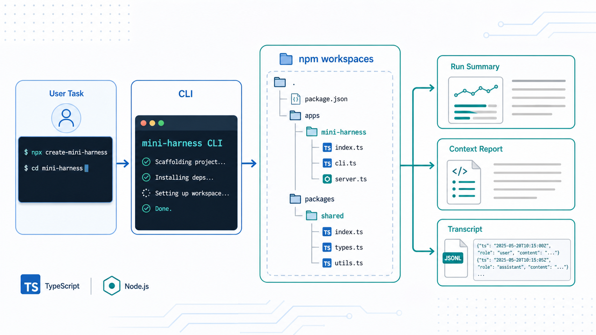

# Day 02 - Project Scaffold / 项目骨架

上一篇：[Day 01 - What is an Agent Harness / 什么是 Agent Harness](https://penglei.dev/blog/2026-06-25-agent-harness/)

## 文章介绍

第一天我们把 Agent Harness 的边界讲清楚了：模型负责生成下一步，harness 负责把用户任务、上下文、工具、安全策略和执行记录组织起来。

第二天开始写代码。但今天不追求模型调用，也不追求真正的工具执行。今天只做一件很基础、但会影响后面所有实现的事：把项目骨架搭出来，并让一个最小 CLI 可以运行。

这听起来像准备工作，但对 coding agent 这类项目来说，骨架不是随便摆文件夹。后面会陆续加入这些模块：

- agent loop
- tool registry
- file tools
- context builder
- transcript logging
- approval and sandbox
- patch editing
- project rules

如果一开始没有清楚的包边界和入口，后面的代码很容易堆成一个巨大的 `cli.ts`。所以 Day 02 的目标是建立一个能持续扩展的 TypeScript + npm workspaces 项目。

## 今天要解决什么

今天要完成四个交付：

1. 根目录是一个 npm workspace。
2. `apps/mini-harness` 是第一个可运行 CLI 应用。
3. `packages/shared` 放共享类型、logger 和 token 工具。
4. CLI 支持最小命令：

```bash
npm run dev -- "hello"
npm run dev -- --context-report "read package structure"
npm run dev -- --transcript logs/runs/day-02.jsonl "hello"
```

今天的 CLI 不会调用真实 LLM。它只会接收任务、打印 scaffold 状态，并在需要时输出一个简化的 context report。这个输出是后续 agent loop 的占位物：先让数据流跑通，再逐步替换内部实现。

## 它在 Cursor/Codex 里对应哪一层

今天实现的是产品最外层的 **CLI surface** 和最基础的 runtime shell。

在 Cursor、Codex、Claude Code 这类产品里，用户最先接触到的不是模型，而是入口：

- 命令行参数怎么解析？
- 当前任务文本从哪里进入系统？
- 是否打开调试报告？
- 是否写 transcript？
- 当前 workspace 的模块如何加载？
- 一个 run 的结果如何返回给终端？

这些都不是模型能力，但它们决定了 harness 能不能稳定承载后续能力。

从分层上看，Day 02 做的是这一层：

```text
User
  -> CLI surface
    -> run summary placeholder
    -> context report placeholder
    -> transcript placeholder
```

后面几天会把 `run summary placeholder` 换成真实的模型调用、工具调用和 agent loop。



上图是 Day 02 的流程示意：用户任务先进入 CLI surface，CLI 再把任务组织进 npm workspaces 里的 `mini-harness` app 和 `shared` package，最后产出 scaffold 阶段的 run summary、context report 和 transcript。

## 设计思路

### 1. 用 npm workspaces 分开 app 和 shared package

项目根目录的 `package.json` 负责声明 workspaces 和统一脚本：

```json
{
  "private": true,
  "type": "module",
  "workspaces": [
    "packages/*",
    "apps/*"
  ],
  "scripts": {
    "dev": "npm run build -w packages/shared && npm run dev -w apps/mini-harness --",
    "build": "npm run build --workspaces",
    "typecheck": "npm run build -w packages/shared && npm run typecheck -w apps/mini-harness",
    "lint": "npm run lint --workspaces"
  }
}
```

这里有一个细节：根目录的 `dev` 先 build `packages/shared`，再启动 app。原因是 `@mini-harness/shared` 通过 package exports 暴露 `dist/*.js`，而不是直接让 app 引用源码。

这让 app 和 shared 的边界更接近真实包，而不是只靠 TypeScript path alias 拼在一起。

### 2. CLI 入口保持很薄

`apps/mini-harness/src/index.ts` 只做一件事：

```ts
import { runCli } from "./cli.js";

await runCli(process.argv.slice(2));
```

真正的参数解析和执行逻辑放在 `cli.ts`。这样做的好处是：后续如果要把同一套 runtime 接到测试、桌面应用或其他入口，`index.ts` 不会变成不可复用的全局脚本。

### 3. 先定义 run summary，而不是直接写死输出

今天的 `createRunSummary` 还不是 agent loop。它只是返回一个稳定结构：

```ts
type RunSummary = {
  message: string;
  contextParts: ContextPart[];
  tools: ToolDefinition[];
};
```

这看起来有点早，但很有用。因为后面会继续增加：

- message history
- tool calls
- tool results
- errors
- latency
- context sources

如果 Day 02 就把输出散落在 `console.log` 里，后面每加一个模块都要重写入口。现在先把结果包成结构体，CLI 只负责展示和落盘。

### 4. 预留 context report 和 transcript

今天的 context report 只是估算几个 context part 的 token 数：

```text
Context Explorer

System prompt          ~...
Tool definitions       ~...
Conversation           ~...
Total                  ~...
```

它不解决真正的上下文选择问题，但先建立了一个重要习惯：harness 应该能解释自己给模型看了什么。

同样，`--transcript` 现在只写一行 JSONL：

```json
{"createdAt":"...","task":"hello","summary":{...}}
```

后续 Day 07 会把它扩展成真正的执行日志。今天先把参数和文件写入路径跑通。

## 实现步骤

### 1. 创建根 workspace

根目录保留 `package.json`、`tsconfig.json`、`.gitignore`、`.editorconfig` 和文档目录。根脚本只负责编排，不直接放业务逻辑。

当前根脚本：

```bash
npm run dev
npm run build
npm run typecheck
npm run lint
```

### 2. 创建 CLI app

`apps/mini-harness/package.json` 定义 app 自己的脚本：

```json
{
  "name": "mini-harness",
  "type": "module",
  "scripts": {
    "dev": "tsx src/index.ts",
    "build": "tsc -p tsconfig.json",
    "typecheck": "tsc -p tsconfig.json --noEmit",
    "lint": "tsc -p tsconfig.json --noEmit"
  },
  "dependencies": {
    "@mini-harness/shared": "0.1.0"
  }
}
```

`tsx` 负责开发期直接运行 TypeScript，`tsc` 负责构建和类型检查。

### 3. 创建 shared package

`packages/shared` 现在包含三类基础能力：

- `logger.ts`: 给 CLI 输出加 scope。
- `types.ts`: 放 `ContextPart`、`ToolDefinition` 等共享类型。
- `token.ts`: 做最粗略的 token 估算。

共享包现在很小，但它的存在会让后续模块更清楚：通用类型放 shared，具体 runtime 行为放 app。

### 4. 实现参数解析

Day 02 的 CLI 支持三个输入形态：

```bash
npm run dev -- "hello"
npm run dev -- --context-report "read package structure"
npm run dev -- --transcript logs/runs/day-02.jsonl "hello"
```

解析规则很简单：

- `--context-report` 打开 context report。
- `--transcript <path>` 指定 JSONL 输出路径。
- 剩余参数拼成用户 task。

如果没有 task，CLI 打印 help 并返回非零 exit code。

### 5. 注册第一个 mock tool

今天还没有真正工具调用，但已经有了 `ToolRegistry`：

```ts
registry.register({
  name: "echo",
  description: "Return the provided input. Used as the first mock tool before real file tools exist.",
  inputSchema: {
    type: "object",
    properties: {
      text: { type: "string" }
    },
    required: ["text"]
  },
  handler: (input) => input
});
```

`echo` 的价值不是功能本身，而是给后续 Day 04 的工具注册表留出位置。到那一天，我们会把工具 schema、dispatcher 和 mock tool 讲完整。

## Demo

运行：

```bash
npm run dev -- "hello"
```

输出类似：

```text
[mini-harness] Task: hello
[mini-harness] Scaffold ready. Future days will replace this summary with the real agent loop.
```

运行 context report：

```bash
npm run dev -- --context-report "read package structure"
```

输出类似：

```text
[mini-harness] Task: read package structure
[mini-harness] Scaffold ready. Future days will replace this summary with the real agent loop.

Context Explorer

System prompt          ~...
Tool definitions       ~...
Conversation           ~...
Total                  ~...
```

运行 transcript：

```bash
npm run dev -- --transcript logs/runs/day-02.jsonl "hello"
```

会追加一行 JSONL 到指定文件，并打印写入路径。

完整 demo 记录见 [Day 02 demo](../demos/day-02/README.md)。

## 当前系统能力变化

完成 Day 02 后，这个仓库不再只是文章集合，而是有了第一个可运行产品切片：

- 可以通过根目录脚本启动 CLI。
- 可以接收用户 task。
- 可以打印 scoped log。
- 可以列出 scaffold 阶段的工具定义。
- 可以输出 context report。
- 可以把 run summary 追加到 JSONL transcript。
- 可以通过 `npm run typecheck` 做基础类型检查。

这还不是 agent，但已经是 agent harness 的外壳。

## 遇到的问题

### 1. 当前 CLI 还没有真实模型调用

这是有意为之。今天如果直接接 OpenAI 或 Anthropic SDK，文章会被 API key、模型参数和错误处理分散注意力。模型调用放到 Day 03。

### 2. 工具注册表只是预留形态

今天注册了 `echo`，但 CLI 不会让模型决定是否调用它。工具调用需要模型输出结构化 action，也需要 agent loop 负责 observe/act。这些会在 Day 04 和 Day 06 展开。

### 3. token 估算非常粗略

今天的 token report 只是帮助观察上下文结构，不用于严肃预算。真正的上下文构建和调试会在 Day 08、Day 09 处理。

## 明天做什么

Day 03 会把静态 scaffold 输出替换成最小 LLM chat loop。

明天的目标是：

- 定义 model message 结构。
- 支持 system/user/assistant messages。
- 抽象一个 model provider 接口。
- 让 CLI 能返回真实 assistant response。

到那一步，`mini-harness` 才会从“能运行的壳”变成“能和模型对话的最小 harness”。
