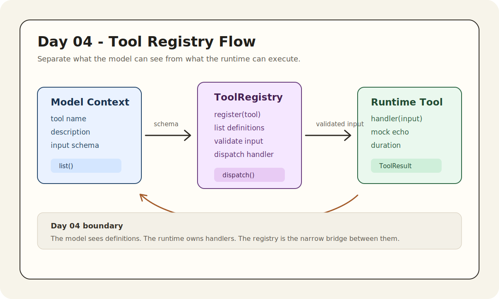

# Day 04 - Tool Registry / 工具注册表

上一篇：[Day 03 - LLM Chat Loop / 最小对话循环](./day-03-llm-chat-loop.md)

## 文章介绍

Day 03 我们把最小 chat loop 接起来了：CLI 把用户任务组织成 system/user messages，交给 model provider，再拿回 assistant message。

但只有 chat loop 的 agent 仍然停留在“会说”的阶段。Coding agent 真正有用，是因为它能读文件、搜索代码、执行命令、生成 diff、申请审批、写 patch。所有这些能力，在 harness 里都要先被建模成 **tools**。

Day 04 不急着做真实文件工具，也不让模型自动决定调用哪个工具。今天只打好工具层的第一块地基：Tool Registry。

Tool Registry 要解决的是一个很朴素的问题：

- 有哪些工具？
- 每个工具需要什么输入？
- 模型应该看到什么 schema？
- runtime 收到工具名和参数后，如何找到 handler？
- 未知工具、错误参数、handler 失败时，错误应该在哪里出现？

## 今天要解决什么

今天要完成四个交付：

1. 定义工具的公开 schema：`name`、`description`、`inputSchema`。
2. 定义 runtime 内部的 registered tool：公开 schema + handler。
3. 实现 `register()`、`list()`、`dispatch()`。
4. 加入第一个 mock tool：`echo`。

同时给 CLI 增加一个手动工具调用入口：

```bash
npm run dev -- --tool echo --tool-input '{"text":"hello"}'
```

这条命令不是 agent loop。它只是证明 registry 可以从工具名分发到 handler，并返回结构化结果。

## 它在 Cursor/Codex 里对应哪一层

今天实现的是 **tool definition layer** 和最小 **tool runtime**。

在 Cursor、Codex、Claude Code 这类系统里，工具层通常同时服务两方：

```text
Model side
  -> sees tool name, description, JSON schema

Runtime side
  -> owns handler, validation, dispatch, errors, result logging
```

模型不应该看到 handler。handler 可能会读文件、执行命令、写 patch，这些都是 runtime 里的真实能力。

runtime 也不能只靠自然语言描述工具。它需要稳定的 schema 和分发表，否则后面加入几十个工具时，所有调用都会变成脆弱的 `if/else`。

Day 04 的位置如下：

```text
User
  -> CLI surface
    -> chat loop
    -> tool registry
      -> tool schema list
      -> manual dispatch
      -> echo handler
    -> context report / transcript
```



Day 06 才会把这条线接进 agent loop，让模型决定是否调用工具。今天先让 runtime 具备“能调用”的能力。

## 设计思路

### 1. ToolDefinition 是给模型看的

共享包里已有 `ToolDefinition`：

```ts
export type ToolDefinition = {
  name: string;
  description: string;
  inputSchema: JsonSchema;
};
```

这部分会进入 context report，也会在后续作为模型可用工具的描述。

对于 `echo`，公开定义是：

```ts
{
  name: "echo",
  description: "Return the provided input. Used as the first mock tool before real file tools exist.",
  inputSchema: {
    type: "object",
    properties: {
      text: { type: "string" },
    },
    required: ["text"],
  },
}
```

这里故意用 JSON schema 风格，而不是 TypeScript 类型。原因是模型 API、MCP、插件系统和很多 agent runtime 都倾向于用 JSON schema 描述工具输入。

### 2. RegisteredTool 是 runtime 内部结构

runtime 需要比模型多知道一件事：handler。

```ts
export type ToolHandler = (input: unknown) => Promise<unknown> | unknown;

export type RegisteredTool = ToolDefinition & {
  handler: ToolHandler;
};
```

`handler` 不会暴露给模型。`list()` 返回工具定义时会把 handler 去掉：

```ts
list(): ToolDefinition[] {
  return [...this.tools.values()].map(({ handler: _handler, ...definition }) => definition);
}
```

这条边界很重要。模型只负责提出“我要调用什么工具，用什么参数”。runtime 才负责真的执行。

### 3. dispatch() 返回结构化结果

Day 04 的 `dispatch()` 不再只返回 handler output，而是返回 `ToolResult`：

```ts
export type ToolResult = {
  name: string;
  input: unknown;
  output: unknown;
  durationMs: number;
};
```

这样做是为了给后面的 transcript logging 留位置。一个工具调用至少应该知道：

- 调了哪个工具。
- 输入是什么。
- 输出是什么。
- 花了多久。

Day 07 会把这些结果进一步拆成 JSONL event。

### 4. 先做很小的 schema validation

完整 JSON Schema validator 可以很复杂。Day 04 没有引入额外依赖，只做最小校验：

- object
- array
- string
- number
- boolean
- null
- required fields
- nested properties

这足够支撑 `echo`，也足够让 Day 05 的 `list_files`、`read_file`、`search_text` 继续扩展。

如果输入不符合 schema，runtime 会抛出明确错误，例如：

```text
[mini-harness] Error: Invalid input for echo: missing required property "text"
[mini-harness] Error: Invalid input for echo.text: expected string
```

## 实现步骤

### 1. 扩展 shared types

文件：[packages/shared/src/types.ts](../packages/shared/src/types.ts)

Day 04 扩展了 `JsonSchema` 的类型枚举，并新增 `ToolCall` / `ToolResult`：

```ts
export type ToolCall = {
  name: string;
  input: unknown;
};

export type ToolResult = {
  name: string;
  input: unknown;
  output: unknown;
  durationMs: number;
};
```

现在 shared package 里同时有：

- 模型消息类型：`ChatMessage`
- 工具定义类型：`ToolDefinition`
- 工具调用/结果类型：`ToolCall`、`ToolResult`

### 2. 实现 ToolRegistry

文件：[apps/mini-harness/src/tools/registry.ts](../apps/mini-harness/src/tools/registry.ts)

核心结构：

```ts
export class ToolRegistry {
  private readonly tools = new Map<string, RegisteredTool>();

  register(tool: RegisteredTool): void {
    if (this.tools.has(tool.name)) {
      throw new Error(`Tool already registered: ${tool.name}`);
    }
    this.tools.set(tool.name, tool);
  }

  list(): ToolDefinition[] {
    return [...this.tools.values()].map(({ handler: _handler, ...definition }) => definition);
  }

  async dispatch(name: string, input: unknown): Promise<ToolResult> {
    const tool = this.tools.get(name);
    if (!tool) {
      throw new Error(`Unknown tool: ${name}`);
    }
    validateInput(tool.inputSchema, input, name);

    const startedAt = performance.now();
    const output = await tool.handler(input);

    return {
      name,
      input,
      output,
      durationMs: Math.round(performance.now() - startedAt),
    };
  }
}
```

这里有三个小决定：

1. 重复注册同名工具直接报错。
2. `list()` 永远不泄露 handler。
3. `dispatch()` 先校验输入，再执行 handler。

### 3. 注册 echo mock tool

`createDefaultToolRegistry()` 现在注册一个 `echo` 工具：

```ts
registry.register({
  name: "echo",
  description: "Return the provided input. Used as the first mock tool before real file tools exist.",
  inputSchema: {
    type: "object",
    properties: {
      text: { type: "string" },
    },
    required: ["text"],
  },
  handler: (input: unknown) => input,
});
```

这个工具没有业务价值，但非常适合验证工具链路。它能暴露所有关键路径：

- schema 是否能进入上下文
- JSON input 是否能解析
- registry 是否能找到工具
- handler 是否能执行
- result 是否能进入 transcript/context report

### 4. 给 CLI 增加手动工具调用入口

文件：[apps/mini-harness/src/cli.ts](../apps/mini-harness/src/cli.ts)

新增两个参数：

```bash
--tool echo
--tool-input '{"text":"hello"}'
```

命令：

```bash
npm run dev -- --tool echo --tool-input '{"text":"hello"}'
```

输出会包含：

```text
[mini-harness] Tool result: {"name":"echo","input":{"text":"hello"},"output":{"text":"hello"},"durationMs":0}
```

如果同时打开 `--context-report`，工具结果也会作为 `tool-results` context part 加进去。
因为这是手动工具 dispatch demo，不需要调用模型，所以 tool-only run 的 provider 会显示为 `none`。

## Demo

详见：[Day 04 demo](../demos/day-04/README.md)

手动调用 echo：

```bash
npm run dev -- --tool echo --tool-input '{"text":"hello"}'
```

带 context report：

```bash
npm run dev -- --context-report --tool echo --tool-input '{"text":"hello"}'
```

错误输入示例：

```bash
npm run dev -- --tool echo --tool-input '{"text":123}'
```

会得到类似错误：

```text
[mini-harness] Error: Invalid input for echo.text: expected string
```

## 当前系统能力变化

Day 04 之后，系统多了这些能力：

- CLI run summary 会继续把工具定义放进上下文。
- runtime 有一个可扩展的 `ToolRegistry`。
- 工具注册和工具公开定义分离。
- 手动 CLI 参数可以触发工具 dispatch。
- 工具输入会经过最小 schema validation。
- 工具执行结果有结构化 `ToolResult`。
- transcript 可以包含工具执行结果。

还没有实现的能力：

- 模型自动选择工具。
- 多步 agent loop。
- 工具调用失败的结构化 event log。
- 真实文件工具。
- approval/sandbox。

## 遇到的问题

### 1. 不要把 Day 04 做成假的 agent loop

很容易在今天就写一个“如果用户说 echo，就调用 echo”的自然语言匹配。但这会把 harness 带到错误方向。

真正的 agent loop 应该由模型输出工具调用意图，runtime 再执行工具。Day 04 还没到这一步，所以 CLI 只提供显式 `--tool` 参数作为 demo 入口。

### 2. JSON Schema 要小心控制范围

完整 JSON Schema 能力很多：`oneOf`、`enum`、`additionalProperties`、`minimum`、`format` 等。今天不需要这些。

过早实现完整 schema validator 会把文章重点从 agent harness 拉到 schema 细节上。现在只做 Day 04 需要的最小子集。

### 3. 工具结果要从一开始就结构化

如果 `dispatch()` 只返回 handler output，后面做 transcript 时还要重新包装调用信息。今天直接返回 `ToolResult`，后续扩展更自然。

## 明天做什么

Day 05 会实现本地文件工具：

- `list_files`
- `read_file`
- `search_text`

到那时，`echo` 会退回到测试/示例位置，registry 会开始承载真正有用的 coding agent 工具。
